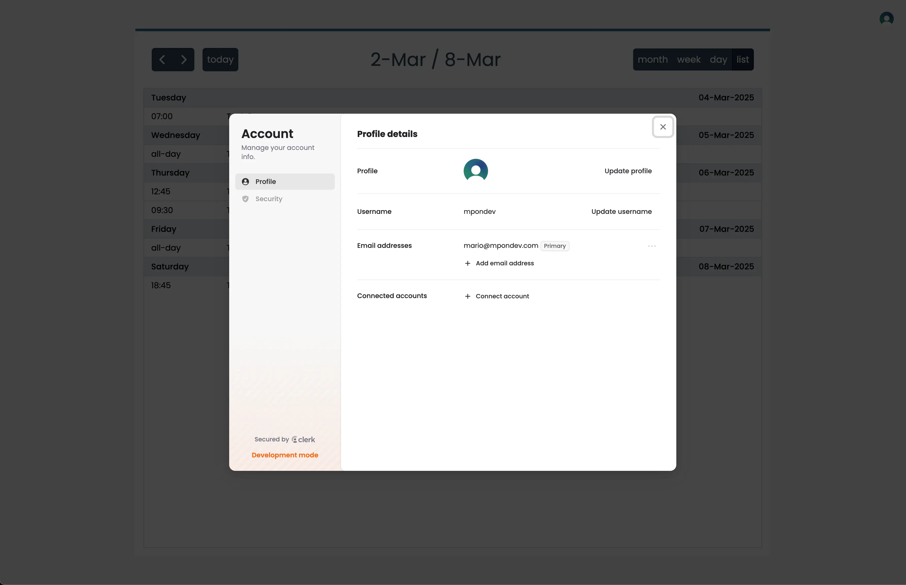

  <h1>Calendar</h1>

  
  
  
  

 

 

## ✨ Características

- Calendario con gestor de tareas incorporado.
- Vista mensual, semanal y diaria y lista resumen de la semana.
- Acceso mediante autenticación tras un sencillo registro o mediante Google, Github o LinkedIn.

 

## ⚙️ Uso

Actualmente estoy trabajando en la App, por lo que aún no está desplegada en mi servidor.

 

## 📦 Packages:

| Package                                                                | Description                                                                                                                                                                                                                          |
| ---------------------------------------------------------------------- | ------------------------------------------------------------------------------------------------------------------------------------------------------------------------------------------------------------------------------------ |
| [@clerk/clerk-react](https://www.npmjs.com/package/@clerk/clerk-react) | Clerk is the easiest way to add authentication and user management to your React application. Add sign up, sign in, and profile management to your application in minutes.                                                           |
| [body-parser](https://www.npmjs.com/package/body-parser)               | Node.js body parsing middleware. Parse incoming request bodies in a middleware before your handlers, available under the req.body property.                                                                                          |
| [cors](https://www.npmjs.com/package/cors)                             | CORS is a node.js package for providing a Connect/Express middleware that can be used to enable CORS with various options.                                                                                                           |
| [dayjs](https://www.npmjs.com/package/dayjs)                           | Day.js is a minimalist JavaScript library that parses, validates, manipulates, and displays dates and times for modern browsers with a largely Moment.js-compatible API. If you use Moment.js, you already know how to use Day.js.js |
| [dotenv](https://www.npmjs.com/package/dotenv)                         | Dotenv is a zero-dependency module that loads environment variables from a .env file into process.env                                                                                                                                |
| [mongoose](https://www.npmjs.com/package/mongoose)                     | Mongoose is a MongoDB object modeling tool designed to work in an asynchronous environment.                                                                                                                                          |
| [prop-types](https://www.npmjs.com/package/prop-types)                 | Runtime type checking for React props and similar objects.                                                                                                                                                                           |
| [react-icons](https://www.npmjs.com/package/react-icons)               | Include popular icons in your React projects easily, utilizing ES6 imports that allows you to include only the icons that your project is using.                                                                                     |
| [svix](https://www.npmjs.com/package/svix)                             | Typescript/Javascript library for interacting with the Svix API and verifying webhook signatures                                                                                                                                     |
| [zustand](https://www.npmjs.com/package/zustand)                       | A small, fast and scalable bearbones state-management solution using simplified flux principles. Has a comfy API based on hooks, isn't boilerplatey or opinionated.                                                                  |

---

Inspired by [FullCalendar](https://fullcalendar.io/)
